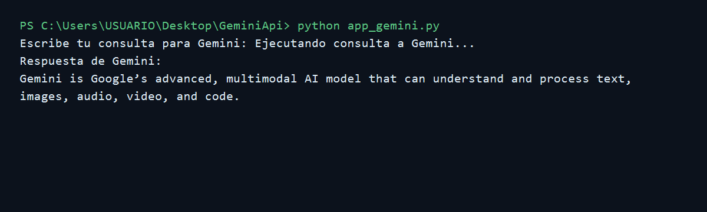

# Conexion a la API de Gemini

Este proyecto contiene un script en Python que se conecta a la API de Gemini usando una clave guardada en un archivo `.env`.

## Requisitos

- Python 3
- Entorno virtual
- Una clave de API de Gemini

## Instalacion

1. Crear y activar el entorno virtual:

```powershell
python -m venv venv
.\venv\Scripts\Activate.ps1
```

2. Instalar las dependencias:

```powershell
pip install -r requirements.txt
```

3. Crear el archivo `.env` tomando como referencia `.env.example`:

```env
GEMINI_API_KEY=TU_CLAVE_DE_GEMINI
```

## Ejecucion

Ejecutar el script:

```powershell
python app_gemini.py
```

El programa pedira escribir una consulta para Gemini:

```txt
Escribe tu consulta para Gemini:
```

Luego mostrara la respuesta generada por el modelo.

## Evidencia de ejecucion



## Archivos principales

- `app_gemini.py`: codigo principal para conectarse a Gemini.
- `requirements.txt`: dependencias del proyecto.
- `.env.example`: ejemplo de configuracion de la clave API.
- `.gitignore`: evita subir la clave real y carpetas del entorno virtual.
- 

